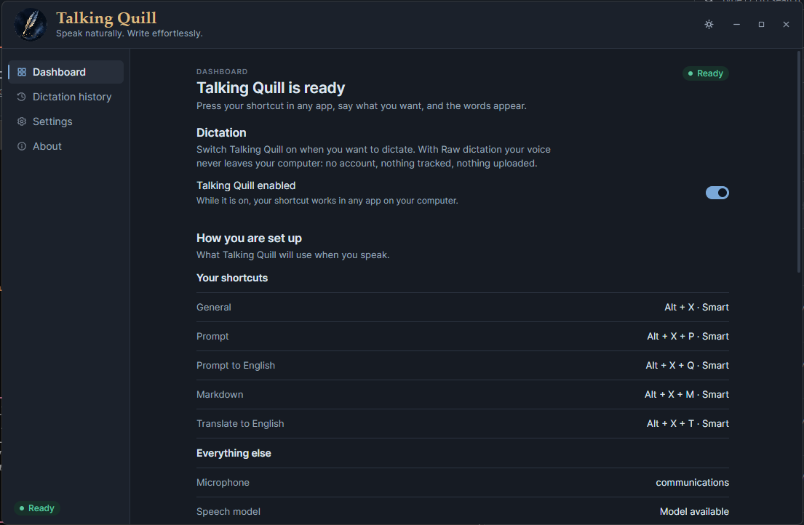

# Talking Quill

**Speak naturally. Get polished text wherever you type.**

Talking Quill is a local-first, system-wide dictation app for Windows and macOS. Your voice is transcribed on your computer, then optional Smart workflows can clean up rough speech, organize ideas, turn notes into well-structured text, translate into another language, or follow your own custom instructions. Use it for messages, documents, prompts, Markdown, and any repeatable writing workflow—without changing how you work.

## Build an installable package

1. Clone the repository:

   ```bash
   git clone https://github.com/gee666/talking-quill.git
   cd talking-quill
   ```

2. Point your coding agent to [`AGENTS-BUILD.md`](AGENTS-BUILD.md) and ask:

   > Follow AGENTS-BUILD.md, install the required toolchain, validate the project, and give me the native installer for this computer.

The agent will detect Windows, macOS, or WSL, prepare the correct build environment, and produce an easy-to-install package for the supported native platform.

## Publish an unsigned release

1. Increment the same strict `MAJOR.MINOR.PATCH` version in `package.json`, `app/package.json`, and `helper/Cargo.toml`.
2. Commit and push the change to the default branch.
3. Open **Actions → Publish unsigned release → Run workflow**.

The manual workflow validates Windows and macOS, builds x64 and ARM64 packages, checks their contents and checksums, creates `v<version>`, and publishes one complete GitHub Release. These packages are intentionally unsigned: Windows SmartScreen and macOS Gatekeeper can warn or block them. Installed releases check the public GitHub release feed at startup. Windows asks before downloading and installing automatically; unsigned macOS builds offer the release page because Squirrel.Mac cannot safely replace an app without a stable Developer ID signature.
